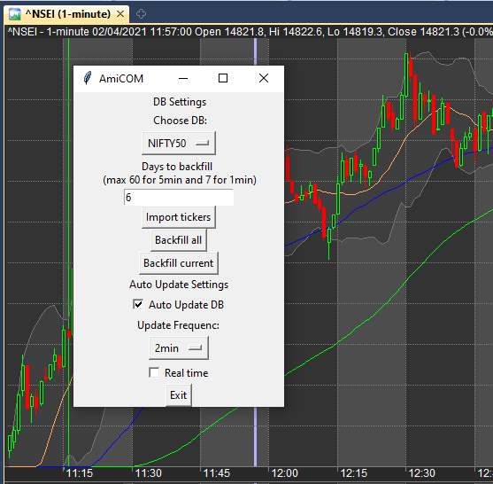

# AmiCOM
AmiCOM (development in progres ) is a python utility to automatically import 
Data from Yahoo finance into Amibroker.

# How to use this?
* Clone this repository into the root of your C drive (VERY IMPORTANT).
* Unzip DB.zip and TickerList.zip within this folder
* install required modules (look at main.py)
* Copy amicom.format into the format ofler inside Amibroker
* run `python main.py`
* Enjoy!

Currently supports upto Nift200 stocks and 1 custom database
Please note that Yahoo finance restricts 2000 api requests per hour per ip, ensure your refresh reate and stock list such that this threshold isnt crossed.

